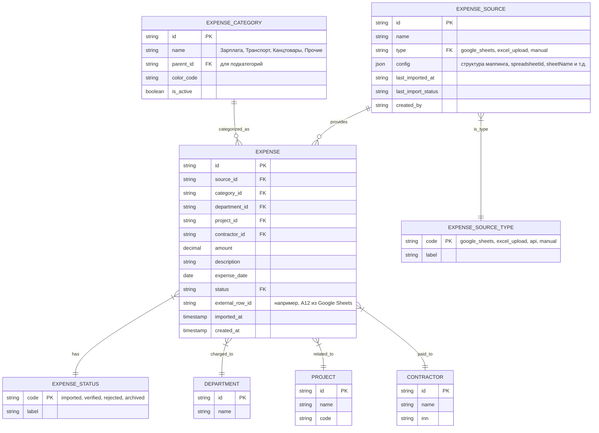

Отлично — приступаем к **ТЗ №3 — Блок «Затраты»**.

Этот модуль критически важен для финансовой прозрачности: он обеспечивает автоматизированный учёт всех расходов компании — от зарплат до канцтоваров — с гибкой настройкой источников и категорий, а также с мощной системой импорта из **Google Sheets**, что позволяет бухгалтерии и менеджерам не вводить данные вручную.

---

# 📄 **Техническое задание №3 — Блок «Затраты»**

> **Статус:** ✅ Готово к разработке  
> **Версия:** 1.0  
> **Дата:** 05.04.2025  
> **Автор:** Менеджер проекта (20+ лет опыта)  
> **Целевая аудитория:** Backend/frontend-разработчики, архитекторы, QA, аналитики, DevOps

---

## 🎯 1. Цели модуля

- Автоматизировать сбор и учёт всех расходов компании из внешних источников (в первую очередь — Google Sheets).
- Обеспечить гибкую настройку категорий и подкатегорий затрат.
- Поддерживать ручной ввод и массовое редактирование.
- Обеспечить привязку к проектам, отделам, контрагентам.
- Генерировать аналитические отчёты по динамике расходов, сравнению с бюджетом, ТОП-категориям.
- Интегрироваться с модулями «Касса», «Банк» и «Продажи» для сквозного учёта.

---

## 🏗️ 2. Архитектурное позиционирование

- **Тип:** Микросервис `expense-service`
- **Язык:** Node.js + NestJS (согласно ADR-001)
- **БД:** PostgreSQL (схема `expenses`)
- **Очереди:** RabbitMQ (для фонового импорта и нотификаций)
- **Внешние интеграции:**
  - Google Sheets API v4 — основной источник данных
  - Модуль «Касса» — для привязки наличных расходов
  - Модуль «Банк» — для привязки безналичных платежей
  - Модуль «Отчёты» — для публикации событий об изменении данных

> ✅ Сервис должен быть полностью конфигурируемым: структура таблиц, маппинг колонок, категории — хранятся в БД, а не зашиты в код.

---

## 🧩 3. Сущности и ERD

### 3.1. Основные сущности



> ✅ Все денежные суммы — `DECIMAL(19,2)`. Даты — в UTC. Строки — с нормализацией пробелов и регистра.

---

## 📥 4. Импорт данных из Google Sheets — детализация

### 4.1. Требования к таблице

Пользователь предоставляет Google Sheet с произвольной структурой. Система должна позволить **настроить маппинг колонок** через UI.

**Пример таблицы:**

| A (Дата)       | B (Сумма) | C (Категория)     | D (Контрагент)   | E (Комментарий)      |
|----------------|-----------|-------------------|------------------|-----------------------|
| 01.04.2025     | 15000     | Зарплата          | Иванов И.И.      | Апрель 2025           |
| 02.04.2025     | 850       | Канцтовары        | ООО "ОфисПлюс"   | Бумага А4             |

### 4.2. Конфигурация источника (в UI)

При создании источника пользователь указывает:

- **Spreadsheet ID** (из URL Google Sheets)
- **Sheet Name** (например, “Апрель 2025”)
- **Диапазон данных** (например, “A2:E100” — с пропуском заголовков)
- **Маппинг колонок:**
  - Дата → Колонка A
  - Сумма → Колонка B
  - Категория → Колонка C (по названию — будет искать в `expense_category.name`)
  - Контрагент → Колонка D (по названию — будет искать или создавать в `contractor`)
  - Описание → Колонка E
- **Правила обработки:**
  - Игнорировать строки, где сумма = 0
  - Пропускать дубли по `external_row_id` (например, “A12”)
  - Автоматически создавать новые категории/контрагентов при отсутствии

> ✅ Реализовать через **конфигурационный адаптер** — отдельный класс `GoogleSheetsExpenseAdapter`, реализующий интерфейс `IExpenseSourceAdapter`.

### 4.3. Алгоритм импорта (фоновая задача)

1. Пользователь нажимает “Запустить импорт” в UI → создается задача в очереди.
2. Worker получает задачу → аутентифицируется через **Service Account** (OAuth2).
3. Читает данные из Google Sheets API → парсит по настроенному маппингу.
4. Валидация каждой строки:
   - Обязательные поля: дата, сумма, категория
   - Корректность формата даты и суммы
   - Существование/создание контрагента и категории
5. Создание записей в `expense` с `status = 'imported'`.
6. Обновление `last_imported_at`, `last_import_status` у источника.
7. Отправка уведомления о результате (успех / ошибки) пользователю.

> ⚠️ **Важно:** Импорт должен быть **идемпотентным** — повторный запуск не создаёт дублей (проверка по `source_id + external_row_id`).

---

## 🗂️ 5. Категории расходов

### 5.1. Предустановленные категории (можно расширять)

- **Зарплата** → подкатегории: Оклад, Премия, Компенсации
- **Транспорт** → подкатегории: Топливо, Такси, Аренда авто
- **Канцтовары**
- **Аренда**
- **Коммунальные услуги**
- **Прочие** → подкатегории: Представительские, Обучение, Ремонт

### 5.2. Управление категориями

- Создание/редактирование/удаление через UI (только для роли “Бухгалтер” и “Администратор”).
- Удаление — только если нет связанных расходов (иначе — архивирование).
- Возможность назначить цвет для визуальной идентификации в отчётах.
- Поддержка вложенных категорий (до 2 уровней).

---

## ⚙️ 6. Конфигурация источников

### 6.1. Типы источников

| Тип            | Описание                                                                 |
|----------------|--------------------------------------------------------------------------|
| Google Sheets  | Основной источник — настраивается маппинг колонок                        |
| Excel Upload   | Загрузка файла через UI → парсинг на сервере (xlsx, csv)                 |
| API            | Вебхук или REST API от другой системы (например, CRM)                    |
| Manual         | Ручной ввод через форму — для разовых операций                           |

> ✅ Все типы источников реализуют общий интерфейс `IExpenseSource` — для унификации логики импорта.

### 6.2. Настройки источника (хранятся в `expense_source.config` как JSON)

**Пример для Google Sheets:**

```json
{
  "spreadsheetId": "1aBcDeFgHiJkLmNoPqRsTuVwXyZ",
  "sheetName": "Расходы за апрель",
  "range": "A2:E200",
  "mapping": {
    "date": "A",
    "amount": "B",
    "category": "C",
    "contractor": "D",
    "description": "E"
  },
  "options": {
    "skipZeroAmount": true,
    "createMissingCategories": true,
    "createMissingContractors": true,
    "dateFormat": "DD.MM.YYYY"
  }
}
```

---

## 🖥️ 7. UI-требования

### 7.1. Основные экраны

- **Список источников** — создание, редактирование, запуск импорта, лог последних импортов.
- **Конфигуратор источника Google Sheets** — пошаговый мастер настройки маппинга.
- **Журнал расходов** — таблица с фильтрами (дата, категория, отдел, проект), сортировкой, пагинацией.
- **Форма ручного ввода расхода** — с автодополнением контрагентов и категорий.
- **Экран редактирования категории** — дерево категорий, цвет, активность.
- **Отчёты** — круговые диаграммы, динамика по месяцам, сравнение с прошлым периодом.

### 7.2. UX-требования

- Drag-and-drop для изменения порядка категорий.
- Подсветка строк с ошибками после импорта (например, не найдена категория).
- Массовое редактирование: изменить категорию/проект для выбранных расходов.
- Возможность экспорта в Excel с сохранением фильтров.
- Undo для удаления расхода (в течение 5 минут).

---

## 🌐 8. API-контракты (фрагменты OpenAPI 3.0)

### 8.1. Создание источника

```yaml
POST /v1/expense-sources
RequestBody:
  content:
    application/json:
      schema:
        $ref: '#/components/schemas/CreateExpenseSourceDto'

CreateExpenseSourceDto:
  type: object
  required: [name, type, config]
  properties:
    name:
      type: string
    type:
      type: string
      enum: [google_sheets, excel_upload, api, manual]
    config:
      type: object
      additionalProperties: true
```

### 8.2. Запуск импорта

```yaml
POST /v1/expense-sources/{id}/import
Parameters:
  - name: id
    in: path
    required: true

Response:
  202:
    description: Import started
    content:
      application/json:
        schema:
          type: object
          properties:
            jobId:
              type: string
            status:
              type: string
              enum: [queued, running]
```

### 8.3. Получение списка расходов

```yaml
GET /v1/expenses
Parameters:
  - name: category
    in: query
  - name: fromDate
    in: query
    schema:
      type: string
      format: date
  - name: departmentId
    in: query

Response:
  200:
    content:
      application/json:
        schema:
          type: object
          properties:
            items:
              type: array
              items:
                $ref: '#/components/schemas/Expense'
            total:
              type: integer
```

---

## 🔄 9. Фоновые задачи и события

### 9.1. Задачи

- `ImportExpensesJob` — импорт из Google Sheets / Excel (запускается по запросу или по расписанию).
- `ValidateExpenseCategoriesJob` — еженедельная проверка на “висячие” расходы с несуществующими категориями.
- `GenerateExpenseReportsJob` — предварительная агрегация данных для отчётов (каждую ночь).

### 9.2. События

```ts
{
  event: "ExpenseImported",
  data: {
    sourceId: "src_123",
    expenseCount: 47,
    failedRows: ["A15", "B88"],
    importedBy: "user_buh_789"
  }
}

{
  event: "ExpenseCreated",
  data: {
    expenseId: "exp_456",
    amount: 15000,
    categoryId: "cat_salary",
    date: "2025-04-01"
  }
}
```

**Подписчики:**
- `reporting-service` — обновляет агрегаты
- `notification-service` — уведомляет о завершении импорта
- `audit-service` — логирует факт изменения

---

## 🧪 10. Тестирование

### 10.1. Unit-тесты

- Парсинг дат и сумм из разных форматов.
- Маппинг колонок Google Sheets.
- Логика создания категорий/контрагентов.
- Валидация DTO.

### 10.2. Интеграционные тесты

- Имитация импорта из Google Sheets → проверка созданных записей.
- Ручное создание расхода → проверка связей.
- Массовое редактирование → проверка обновления статусов.

### 10.3. E2E-тесты

- Полный сценарий: создать источник → настроить маппинг → запустить импорт → проверить журнал → отредактировать категорию → проверить отчёт.

### 10.4. Тесты на отказоустойчивость

- Импорт при недоступности Google API → повтор через 5 минут.
- Импорт при некорректных данных → создание только валидных строк, лог ошибок.

---

## 🚚 11. Миграция данных

### 11.1. Источники

- Старые Excel-файлы бухгалтерии.
- Google Sheets, используемые сейчас.
- CSV-выгрузки из 1С.

### 11.2. Этапы

1. **Анализ структур** — сбор всех шаблонов таблиц.
2. **Создание конфигураций источников** — по одному на каждый шаблон.
3. **Загрузка справочников** — категории, контрагенты, проекты.
4. **Пакетный импорт** — через фоновые задачи с логированием.
5. **Сверка итогов** — суммы по категориям до/после.
6. **Параллельная работа** — 2 недели с ручной сверкой.
7. **Переход на автоматизированный учёт.**

> ✅ Все скрипты миграции — идемпотентны и логируют каждую операцию.

---

## 🛡️ 12. Безопасность и аудит

- Доступ к настройке источников — только для ролей “Бухгалтер” и “Администратор”.
- OAuth2-токен для Google Sheets — хранится в Vault, не в БД.
- Все операции импорта — логируются с указанием пользователя.
- Просмотр расходов отдела — только для руководителя отдела и бухгалтерии.
- Шифрование sensitive-данных (например, spreadsheetId) при необходимости.

---

## 📅 13. План разработки

| Sprint | Задачи |
|--------|--------|
| Sprint 1 | Ядро: сущности, CRUD, категории, статусы |
| Sprint 2 | Импорт из Google Sheets: адаптер, фоновые задачи, маппинг |
| Sprint 3 | UI: источники, журнал расходов, ручной ввод |
| Sprint 4 | Отчёты, интеграции с другими модулями, миграция |
| Sprint 5 | Тестирование, оптимизация, UAT, документация |

---

## ✅ 14. Критерии готовности (DoD)

Для каждой фичи:

- [ ] Реализовано по ТЗ и макетам
- [ ] Покрыто тестами (>85%)
- [ ] API задокументировано в Swagger
- [ ] Прошёл код-ревью
- [ ] Развернуто на staging, протестировано QA
- [ ] Написан runbook (как настроить источник, как запустить импорт)
- [ ] Настроены метрики (количество импортированных строк, ошибки)
- [ ] Производительность: импорт 1000 строк < 30 сек

---

## 📎 15. Приложения

- [ERD-диаграмма](/docs/erd/expense-service.png)
- [Swagger-спецификация](/docs/swagger/expense-service.yaml)
- [Пример конфига источника](/examples/expense-source-config.json)
- [Скрипты миграции](/migrations/expense/)

---

> ✅ **ТЗ №3 — Блок «Затраты» — готово к передаче в разработку.**

---

## ➡️ Что дальше?

Я могу:

1. **Начать подготовку ТЗ №4 — Блок «Продажи»** — с учётом связей с кассой и затратами, структурой документов и позиций.
2. **Подготовить черновики ADR** (001, 002, 003) — если ещё не сделано.
3. **Создать стартовый репозиторий `expense-service`** — с NestJS, Google API SDK, TypeORM, BullMQ, тестами и CI.

👉 **Укажите, какой следующий шаг вы хотите — и я немедленно приступлю.**

Готов двигаться в любом направлении!