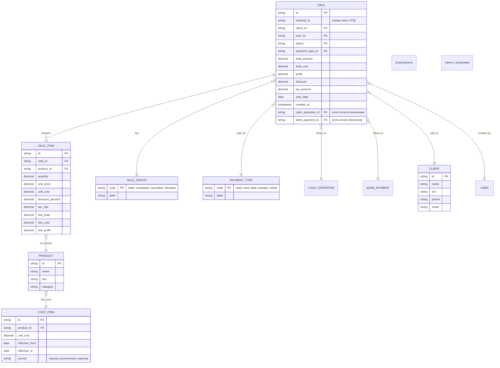

Отлично — приступаем к **ТЗ №4 — Блок «Продажи»**.

Этот модуль — **центр финансового цикла компании**: он связывает выручку с кассой и затратами, обеспечивает учёт каждой продажи до позиции в чеке, формирует основу для отчётности и аналитики. Особое внимание уделено **интеграциям** — с кассой (приход денег), с затратами (себестоимость), с банком (безналичные поступления).

---

# 📄 **Техническое задание №4 — Блок «Продажи»**

> **Статус:** ✅ Готово к разработке  
> **Версия:** 1.0  
> **Дата:** 05.04.2025  
> **Автор:** Менеджер проекта (20+ лет опыта)  
> **Целевая аудитория:** Backend/frontend-разработчики, архитекторы, QA, аналитики, DevOps

---

## 🎯 1. Цели модуля

- Учёт всех продаж компании: от розничных чеков до оптовых накладных.
- Детализация по позициям: товар, количество, цена, скидка, НДС.
- Привязка к кассовым операциям (наличные/безнал) и банковским поступлениям.
- Учёт себестоимости → расчёт маржинальности.
- Формирование первичных документов (чеки, УПД, акты).
- Интеграция с внешними кассами (ФР, ОФД) и CRM.
- Генерация отчётов: выручка по периодам, ТОП товаров, динамика, план vs факт.

---

## 🏗️ 2. Архитектурное позиционирование

- **Тип:** Микросервис `sales-service`
- **Язык:** Node.js + NestJS
- **БД:** PostgreSQL (схема `sales`)
- **Очереди:** RabbitMQ (для фоновой генерации документов и интеграций)
- **Интеграции:**
  - Модуль «Касса» → события о поступлении денег → привязка к продаже
  - Модуль «Затраты» → запрос себестоимости товара → расчёт прибыли
  - Модуль «Банк» → привязка безналичных платежей
  - Внешние ККТ / ОФД → загрузка чеков по ФФД 1.2
  - CRM → передача данных о клиентах и заказах

> ✅ Сервис должен поддерживать как ручной ввод, так и массовый импорт (из ККТ, CRM, Excel).

---

## 🧩 3. Сущности и ERD

### 3.1. Основные сущности



> ✅ Все денежные значения — `DECIMAL(19,2)`.  
> ✅ `unit_cost` берётся из `cost_item` на дату продажи — для корректного расчёта прибыли.

---

## 📦 4. Структура документа продажи

### 4.1. Заголовок документа

- Номер (внешний — из ККТ или внутренний)
- Дата и время
- Клиент (наименование, ИНН, контакты)
- Тип оплаты
- Статус
- Сумма, скидка, налог, итого
- Привязка к кассовой операции / банковскому платежу

### 4.2. Табличная часть (позиции)

| Товар       | Кол-во | Цена за ед. | Скидка, % | Стоимость | Себестоимость | Прибыль |
|-------------|--------|-------------|-----------|-----------|----------------|---------|
| Кофе латте  | 2      | 350.00      | 0         | 700.00    | 120.00         | 580.00  |
| Пирожное    | 1      | 250.00      | 10        | 225.00    | 80.00          | 145.00  |

> ✅ При сохранении документа — автоматически рассчитывается:
> - `line_total = quantity * unit_price * (1 - discount_percent/100)`
> - `line_cost = quantity * unit_cost`
> - `line_profit = line_total - line_cost`
> - `total_amount = SUM(line_total)`
> - `total_cost = SUM(line_cost)`
> - `profit = total_amount - total_cost`

---

## 🔗 5. Связи с другими модулями

### 5.1. Связь с модулем «Касса»

- При создании продажи с типом оплаты “Наличные” или “Карта” — система предлагает привязать существующую **кассовую операцию** (если деньги уже внесены) или создать новую.
- Если кассовая операция создаётся позже — продажа остаётся в статусе “Черновик” до привязки.
- Автоматическая сверка: если сумма в кассе ≠ сумме продажи — уведомление бухгалтеру.

### 5.2. Связь с модулем «Затраты»

- При добавлении позиции — система запрашивает **текущую себестоимость** товара из `cost_item` (по дате продажи).
- Если себестоимость не найдена — уведомление, но документ можно сохранить (себестоимость = 0).
- При изменении себестоимости в прошлом — пересчёт прибыли по историческим продажам (фоновая задача).

### 5.3. Связь с модулем «Банк»

- При оплате “Безнал” или “Онлайн” — привязка к банковскому платежу по сумме + дате ±1 день или по `external_id`.
- Автоматическое закрытие продажи при подтверждении платежа.

---

## 🔄 6. Бизнес-процессы

### 6.1. Жизненный цикл продажи

```
[Черновик] → (привязка к кассе/банку) → [Проведён] → [Оплачен]
                                     ↘ (отмена) → [Аннулирован]
                                     ↘ (возврат) → [Возвращён] → (корректировка кассы)
```

### 6.2. Процесс создания продажи

1. Выбор клиента (или “Розничный покупатель”).
2. Добавление позиций (вручную или сканированием штрихкода).
3. Применение скидки (на позицию или весь чек).
4. Выбор типа оплаты.
5. Сохранение → документ в статусе “Черновик”.
6. Проведение кассовой операции → привязка → статус “Проведён”.
7. При безнале — ожидание подтверждения из банка → статус “Оплачен”.

### 6.3. Процесс возврата

1. Выбор исходного документа продажи.
2. Создание документа возврата (с отрицательными суммами).
3. Автоматическое создание обратной кассовой операции.
4. Обновление статуса исходного документа → “Частично возвращён” / “Полностью возвращён”.

---

## 🖥️ 7. UI-требования

### 7.1. Основные экраны

- **Кассовый интерфейс (POS)** — быстрый ввод товаров, выбор клиента, оплата, печать чека.
- **Журнал продаж** — фильтры по дате, клиенту, статусу, типу оплаты, экспорт в Excel.
- **Детали продажи** — просмотр позиций, привязка к кассе/банку, кнопка возврата.
- **Форма создания/редактирования** — с автодополнением товаров и клиентов.
- **Отчёты** — выручка по дням/неделям/месяцам, ТОП товаров, маржинальность, динамика.

### 7.2. UX-требования

- Горячие клавиши для кассового интерфейса (F2 — добавить товар, F5 — оплатить).
- Подсветка непроведённых продаж (жёлтый цвет).
- Подтверждение перед удалением/возвратом.
- Undo в течение 5 минут.
- Массовое редактирование статусов (например, “Провести все черновики за сегодня”).

---

## 🌐 8. API-контракты (фрагменты OpenAPI 3.0)

### 8.1. Создание продажи

```yaml
POST /v1/sales
RequestBody:
  content:
    application/json:
      schema:
        $ref: '#/components/schemas/CreateSaleDto'

CreateSaleDto:
  type: object
  required: [items, clientId, paymentType]
  properties:
    externalId:
      type: string
    clientId:
      type: string
    paymentType:
      type: string
      enum: [cash, card, bank_transfer, online]
    items:
      type: array
      items:
        $ref: '#/components/schemas/SaleItemDto'
    discount:
      type: number
      format: float

SaleItemDto:
  type: object
  required: [productId, quantity, unitPrice]
  properties:
    productId:
      type: string
    quantity:
      type: number
      format: float
    unitPrice:
      type: number
      format: decimal
    discountPercent:
      type: number
      format: float
```

### 8.2. Привязка к кассовой операции

```yaml
POST /v1/sales/{id}/link-cash-operation
Parameters:
  - name: id
    in: path
    required: true
RequestBody:
  content:
    application/json:
      schema:
        type: object
        properties:
          cashOperationId:
            type: string
```

### 8.3. Получение отчёта по выручке

```yaml
GET /v1/sales/reports/revenue
Parameters:
  - name: fromDate
    in: query
    schema:
      type: string
      format: date
  - name: toDate
    in: query
    schema:
      type: string
      format: date
  - name: groupBy
    in: query
    schema:
      type: string
      enum: [day, week, month, product, client]

Response:
  200:
    content:
      application/json:
        schema:
          type: array
          items:
            type: object
            properties:
              group:
                type: string
              revenue:
                type: number
              cost:
                type: number
              profit:
                type: number
```

---

## 🔄 9. Фоновые задачи и события

### 9.1. Задачи

- `RecalculateProfitJob` — пересчёт прибыли при изменении себестоимости (по cron или по событию).
- `SyncWithOFDJob` — загрузка чеков из оператора фискальных данных (раз в час).
- `GenerateSalesReportJob` — агрегация данных для отчётов (каждую ночь).

### 9.2. События

```ts
{
  event: "SaleCompleted",
   {
    saleId: "sale_123",
    totalAmount: 925.00,
    profit: 725.00,
    paymentType: "cash",
    clientId: "cli_456"
  }
}

{
  event: "SaleRefunded",
   {
    originalSaleId: "sale_123",
    refundSaleId: "sale_789",
    refundAmount: -925.00
  }
}
```

**Подписчики:**
- `cashbox-service` — обновление остатков
- `expense-service` — учёт в отчётах по выручке
- `reporting-service` — обновление дашбордов
- `notification-service` — уведомление о крупных продажах/возвратах

---

## 🧪 10. Тестирование

### 10.1. Unit-тесты

- Расчёт итогов документа (с учётом скидок и налогов).
- Логика привязки к кассе/банку.
- Валидация DTO.

### 10.2. Интеграционные тесты

- Создание продажи → привязка к кассовой операции → проверка статуса.
- Изменение себестоимости → пересчёт прибыли по историческим продажам.
- Создание возврата → проверка обратной кассовой операции.

### 10.3. E2E-тесты

- Полный сценарий: создать клиента → добавить товар → провести продажу → оплатить наличными → проверить отчёт.
- Сценарий возврата: выбрать продажу → создать возврат → проверить обновление остатков.

### 10.4. Нагрузочное тестирование

- Создание 1000 продаж в минуту → проверка времени ответа < 500 мс.
- Параллельные возвраты → проверка блокировок и согласованности данных.

---

## 🚚 11. Миграция данных

### 11.1. Источники

- Выгрузки из старой CRM / 1С.
- Экспорты из ККТ (чеки за последние 6 месяцев).
- Excel-файлы бухгалтерии.

### 11.2. Этапы

1. **Анализ структур** — сбор всех форматов документов.
2. **Загрузка справочников** — клиенты, товары, себестоимость.
3. **Пакетная загрузка продаж** — с привязкой к существующим товарам и клиентам.
4. **Создание кассовых операций** — на основании типа оплаты.
5. **Сверка итогов** — выручка по периодам до/после.
6. **Параллельная работа** — 2 недели.
7. **Переход на новую систему.**

> ✅ Все скрипты — идемпотентны, с логированием, с возможностью отката.

---

## 🛡️ 12. Безопасность и аудит

- Доступ к созданию/редактированию — только для ролей “Кассир”, “Менеджер по продажам”, “Бухгалтер”.
- Просмотр себестоимости — только для “Бухгалтер” и “Администратор”.
- Все операции логируются: кто создал/изменил/удалил продажу.
- Шифрование sensitive-данных (например, external_id из ОФД).
- Аудит изменений себестоимости — отдельный журнал.

---

## 📅 13. План разработки

| Sprint | Задачи |
|--------|--------|
| Sprint 1 | Ядро: сущности, CRUD, расчёт итогов, статусы |
| Sprint 2 | Интеграции: привязка к кассе и банку, себестоимость |
| Sprint 3 | UI: POS-интерфейс, журнал, форма возврата |
| Sprint 4 | Фоновые задачи, интеграция с ОФД, миграция |
| Sprint 5 | Отчёты, тестирование, UAT, документация |

---

## ✅ 14. Критерии готовности (DoD)

Для каждой фичи:

- [ ] Реализовано по ТЗ и макетам
- [ ] Покрыто тестами (>85%)
- [ ] API задокументировано в Swagger
- [ ] Прошёл код-ревью
- [ ] Развернуто на staging, протестировано QA
- [ ] Написан runbook (как создать продажу, как привязать к кассе)
- [ ] Настроены метрики (количество продаж, средний чек, маржинальность)
- [ ] Производительность: создание продажи < 300 мс, отчёт за месяц < 2 сек

---

## 📎 15. Приложения

- [ERD-диаграмма](/docs/erd/sales-service.png)
- [Swagger-спецификация](/docs/swagger/sales-service.yaml)
- [Пример документа продажи (JSON)](/examples/sale-document.json)
- [Скрипты миграции](/migrations/sales/)

---

> ✅ **ТЗ №4 — Блок «Продажи» — готово к передаче в разработку.**

---

## ➡️ Что дальше?

Я могу:

1. **Начать подготовку ТЗ №5 — Блок «Касса»** — с детализацией workflow, типов операций, сверки с банком.
2. **Подготовить черновики ADR**, если ещё не сделано.
3. **Создать стартовый репозиторий `sales-service`** — с NestJS, TypeORM, интеграционными тестами, CI.

👉 **Укажите, какой следующий шаг вы хотите — и я немедленно приступлю.**

Готов к любому развитию событий!