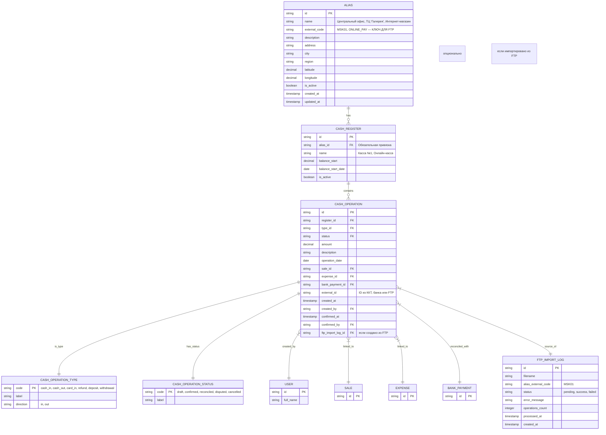

Готово. Ниже — **полное, финальное, структурированное Техническое задание №5 — Блок «Касса»**, объединяющее:

- ✅ Базовый функционал (workflow, типы операций, сверка с банком)
- ✅ Расширение: **загрузка из Excel по FTP**
- ✅ Расширение: **Алиасы** (вместо «Местоположений» — по вашему требованию)
- ✅ Единая структура, устранение дублей, чёткие зависимости
- ✅ Готово к передаче в разработку

---

# 📄 **Техническое задание №5 — Блок «Касса» (финальная версия v1.2)**

> **Статус:** ✅ Готово к разработке  
> **Версия:** 1.2 (с поддержкой **Алиасов** и **FTP-импорта из Excel**)  
> **Дата:** 05.04.2025  
> **Автор:** Менеджер проекта (20+ лет опыта)  
> **Целевая аудитория:** Backend/frontend-разработчики, архитекторы, QA, DevOps, кассиры, бухгалтеры

---

## 🎯 1. Цели модуля

- Учёт всех кассовых операций: приход, расход, возврат, инкассация.
- Поддержка разных типов оплаты: наличные, карта, онлайн, QR, перевод.
- Привязка операций к документам: продажам, возвратам, затратам.
- Автоматическая и ручная сверка с банковскими выписками.
- Контроль целостности: итоги кассы = сумма операций за период.
- Формирование отчётов: остаток на конец дня, движение ДС, сверка с банком.
- Обеспечение аудита и прозрачности: кто, когда, что внес/выдал.
- **Расширение:** Учёт **Алиасов** — для привязки касс к логическим/физическим точкам (офис, магазин, терминал) и аналитики по ним.
- **Расширение:** Поддержка **загрузки операций из Excel-файлов по FTP** — для интеграции со старыми системами, POS-терминалами, филиалами.

---

## 🏗️ 2. Архитектурное позиционирование

- **Тип:** Микросервис `cashbox-service`
- **Язык:** Node.js + NestJS
- **БД:** PostgreSQL (схема `cashbox`)
- **Очереди:** RabbitMQ (для фоновой сверки, FTP-импорта и нотификаций)
- **Новые зависимости:**
  - `basic-ftp` — для подключения к FTP-серверу
  - `exceljs` — для парсинга Excel-файлов
- **Интеграции:**
  - Модуль «Продажи» → создание операций при проведении чеков
  - Модуль «Затраты» → создание расходных операций
  - Модуль «Банк» → сверка поступлений по безналу
  - Внешние ККТ / POS-терминалы → автоматическое создание операций
  - CRM / ERP → импорт операций
  - **FTP-сервер → автоматическая загрузка Excel-файлов с операциями**

> ✅ Сервис должен поддерживать как ручной ввод (кассир), так и автоматическую синхронизацию (API, FTP, выгрузки).

---

## 🧩 3. Сущности и ERD

### 3.1. Основные сущности (включая Алиасы и FTP-логи)



> ✅ Все денежные значения — `DECIMAL(19,2)`.  
> ✅ `direction` в `CASH_OPERATION_TYPE` — для автоматического расчёта остатков (`in` = +amount, `out` = -amount).  
> ✅ `external_code` в `ALIAS` — **уникальный, неизменяемый** — используется для сопоставления при FTP-импорте.

---

## 🔄 4. Workflow кассовой операции

### 4.1. Жизненный цикл операции

```
[Черновик] → (подтверждение кассиром) → [Подтверждено] → (сверка с банком) → [Сверено]
                                     ↘ (ошибка/спор) → [Оспорено] → (корректировка) → [Подтверждено]
                                     ↘ (отмена до подтверждения) → [Аннулировано]
```

> ⚠️ **Для операций, импортированных из FTP:**  
> - Создаются сразу в статусе **«Подтверждено»** (если нет ошибок валидации).  
> - При ошибке — не создаются, файл не архивируется, статус в `ftp_import_log` = `failed`.

### 4.2. Процесс создания операции

#### Сценарий 1: Ручной ввод (кассир)

1. Кассир выбирает **кассу** (с указанием Алиаса), **тип операции**.
2. Вводит сумму, описание, при необходимости — привязывает к документу.
3. Сохраняет → операция в статусе “Черновик”.
4. Подтверждает → статус “Подтверждено”, фиксируется `confirmed_at` и `confirmed_by`.
5. Система обновляет остаток по кассе.

#### Сценарий 2: Автоматическое создание (из продажи)

1. При проведении продажи → система создаёт операцию соответствующего типа.
2. Операция в статусе “Подтверждено”.
3. Привязывается к `sale_id`.

#### Сценарий 3: Импорт из FTP (Excel)

1. Фоновая задача находит файл `cash_operations_MSK01_20250405.xlsx`.
2. Парсит Excel → для каждой строки создаётся операция.
3. Определяет `alias_external_code` → находит **Алиас** → привязывает к кассе (создаёт кассу, если не существует).
4. При успешной валидации — создаёт операцию в статусе “Подтверждено”, привязывает к `ftp_import_log`.
5. Перемещает файл в архив.
6. При ошибке — логирует, оставляет файл на FTP, уведомляет администратора.

---

## 💳 5. Типы кассовых операций

| Код             | Название               | Направление | Описание |
|-----------------|------------------------|-------------|----------|
| `cash_in`       | Приход наличными       | in          | Оплата от клиента наличными |
| `cash_out`      | Расход наличными       | out         | Выдача под отчёт, возврат |
| `card_in`       | Оплата картой          | in          | Оплата через POS-терминал |
| `online_in`     | Онлайн-оплата          | in          | Оплата через сайт/приложение |
| `refund`        | Возврат клиенту        | out         | Возврат за товар/услугу |
| `deposit`       | Инкассация (в банк)    | out         | Сдача денег в банк |
| `withdrawal`    | Получение из банка     | in          | Получение наличных из банка |

> ✅ При создании операции — автоматически обновляется `balance` кассы:  
> `new_balance = previous_balance + (direction == 'in' ? amount : -amount)`

---

## 🏷️ 6. Алиасы (Aliases)

### 6.1. Назначение

**Алиас** — уникальный идентификатор точки учёта. Используется для:

- Группировки касс (например, все кассы магазина “Галерея”).
- Аналитики по регионам, городам, каналам продаж.
- **Автоматического сопоставления при FTP-импорте** через `external_code`.

### 6.2. Управление

- CRUD через API/UI.
- `external_code` — задаётся при создании, **неизменяем**.
- Удаление — только если нет связанных касс.
- Координаты — опционально (для карт).

### 6.3. Примеры

| external_code | name                                 | Описание                     |
|---------------|--------------------------------------|------------------------------|
| `NM_CENTRAL`  | NANU Market nr. 1  [Constructorilor] | Все кассы NANU Market nr. 1  |
| `NM_Bacioi`   | NANU Market nr. 3  [Bacioi]          | Все кассы NANU Market nr. 3  |
| `NM_Cosnita`  | NANU Market nr. 4  [Cosnita]         | Все кассы NANU Market nr.    |

---

## 📥 7. Загрузка из Excel по FTP

### 7.1. Требования к файлу

- **Имя файла:** `cash_operations_{alias_external_code}_{YYYYMMDD}.xlsx`  
  Пример: `cash_operations_MSK01_20250405.xlsx`
- **Формат:** `.xlsx` или `.xls`
- **Структура листа (обязательные колонки):**

| Колонка           | Обязательно | Описание / Пример                     |
|-------------------|-------------|----------------------------------------|
| `operation_date`  | Да          | 05.04.2025                             |
| `type_code`       | Да          | cash_in, card_in, refund               |
| `amount`          | Да          | 5000.00                                |
| `description`     | Нет         | Оплата за товар                        |
| `external_id`     | Нет         | POS_TXN_12345                          |
| `sale_external_id`| Нет         | Для привязки к продаже                 |
| `expense_id`      | Нет         | Для привязки к затрате                 |

### 7.2. Конфигурация FTP

```yaml
ftp:
  host: "ftp.company.com"
  port: 21
  username: "cash_importer"
  password: "${FTP_PASSWORD}"  # из Vault
  directory: "/incoming/cash/"
  archiveDirectory: "/archive/cash/"
  pollIntervalMinutes: 30
  allowedExtensions: [".xlsx", ".xls"]
  dateFormat: "DD.MM.YYYY"
```

### 7.3. Алгоритм импорта

1. **Опрос FTP** — каждые 30 минут.
2. **Скачивание файла** — по маске `cash_operations_*.xlsx`.
3. **Парсинг Excel** — валидация структуры и данных.
4. **Определение Алиаса** — по `{alias_external_code}` → поиск по `ALIAS.external_code`.
5. **Создание кассы** — если касса для этого Алиаса не существует → создаётся автоматически.
6. **Импорт операций** — создание записей в статусе “Подтверждено”.
7. **Архивирование** — перемещение файла в `/archive/` при успехе.
8. **Логирование** — запись в `ftp_import_log` со статусом, количеством операций, ошибками.
9. **Уведомление** — при ошибках — отправка алерта администратору.

> ✅ **Идемпотентность:** Проверка по `external_id` — если операция уже существует, пропустить.  
> ✅ **Безопасность:** Пароль FTP — только в Vault / .env.

---

## 🔍 8. Сверка с банком

### 8.1. Цели

- Убедиться, что все безналичные поступления (`card_in`, `online_in`) отражены в банковской выписке.
- Выявить несоответствия.
- Автоматически закрыть операции, найденные в выписке.

### 8.2. Алгоритм

1. Запуск вручную или по расписанию.
2. Выбор операций со статусом ≠ “Сверено” за период.
3. Запрос выписки из банка (API или файл).
4. Сопоставление по: сумме (±1 рубль), дате (±1 день), `external_id`.
5. При совпадении — установка `bank_payment_id`, статус → “Сверено”.
6. При несовпадении — статус → “Оспорено”, уведомление.
7. Логирование результатов.

> ✅ Реализовать через **адаптеры банков** — отдельный класс на каждый банк, реализующий интерфейс `IBankReconciliationAdapter`.

---

## 🖥️ 9. UI-требования

### 9.1. Основные экраны

- **Журнал операций** — фильтры по кассе, типу, статусу, дате, **Алиасу**, документу. Экспорт в Excel.
- **Форма создания операции** — с выбором кассы (с указанием Алиаса), типа, суммы, привязки.
- **Экран сверки с банком** — таблица несопоставленных операций, кнопка “Запустить сверку”, ручное сопоставление.
- **Справочник Алиасов** — CRUD, поиск, экспорт.
- **Журнал FTP-импортов** — список файлов, статус, ошибки, количество операций.
- **Отчёты:**
  - Остаток по кассам (с группировкой по Алиасам)
  - Движение ДС за период
  - Сверка с банком
  - Выручка по Алиасам (каналам/точкам)

### 9.2. UX-требования

- Подтверждение перед удалением/отменой.
- Undo в течение 5 минут.
- Подсветка “Оспорено” — красным.
- Горячие клавиши для кассира (F1/F2).
- Массовое подтверждение операций.

---

## 🌐 10. API-контракты (фрагменты OpenAPI 3.0)

### 10.1. CRUD Алиасов

```yaml
POST /v1/aliases
GET /v1/aliases
PATCH /v1/aliases/{id}
DELETE /v1/aliases/{id}  # только если нет связанных касс
```

### 10.2. Создание кассовой операции

```yaml
POST /v1/cash-operations
RequestBody:
  content:
    application/json:
      schema:
        $ref: '#/components/schemas/CreateCashOperationDto'
```

### 10.3. Запуск FTP-импорта (ручной)

```yaml
POST /v1/ftp-import/trigger
Response:
  202:
    description: Import started
    content:
      application/json:
        schema:
          type: object
          properties:
            jobId: string
```

### 10.4. Логи FTP-импорта

```yaml
GET /v1/ftp-import/logs
Parameters:
  - name: fromDate
    schema:
      type: string
      format: date
```

### 10.5. Запуск сверки с банком

```yaml
POST /v1/cash-registers/{id}/reconcile-with-bank
```

---

## 🔄 11. Фоновые задачи и события

### 11.1. Задачи

| Задача                     | Описание |
|----------------------------|----------|
| `PollFtpForCashFilesJob`   | Опрос FTP, постановка файлов в очередь |
| `ProcessCashExcelFileJob`  | Парсинг Excel, создание операций, архивирование |
| `ReconcileWithBankJob`     | Сверка операций с банковской выпиской |
| `RecalculateCashBalanceJob`| Пересчёт остатков по кассам |
| `NotifyFailedFtpImportsJob`| Уведомление об ошибках FTP-импорта |

### 11.2. События

```json
{
  "event": "CashOperationConfirmed",
  "data": {
    "operationId": "op_123",
    "amount": 5000.00,
    "typeId": "cash_in",
    "registerId": "reg_main"
  }
}

{
  "event": "FtpImportCompleted",
  "data": {
    "filename": "cash_operations_MSK01_20250405.xlsx",
    "aliasExternalCode": "MSK01",
    "status": "success",
    "operationsCount": 47
  }
}
```

**Подписчики:** `sales-service`, `reporting-service`, `notification-service`.

---

## 🧪 12. Тестирование

### 12.1. Unit-тесты

- Расчёт остатка кассы.
- Парсинг имени файла и Excel-строки.
- Логика сверки с банком.
- Валидация DTO.

### 12.2. Интеграционные тесты

- Создание операции → подтверждение → проверка остатка.
- FTP-импорт → проверка создания кассы и операций.
- Сверка с банком → проверка статусов.

### 12.3. E2E-тесты

- Полный сценарий: FTP-файл → импорт → операция в UI → сверка с банком → отчёт.
- Сценарий ошибки: неверный тип операции → лог ошибки, файл не архивирован.

### 12.4. Нагрузка и отказоустойчивость

- Импорт 1000 операций < 30 сек.
- Повтор при недоступности FTP/банка.

---

## 🚚 13. Миграция данных

1. Загрузка существующих **Алиасов** и **касс**.
2. Импорт исторических операций:
   - Из 1С/Excel — через ручную загрузку или FTP.
   - Из логов ККТ — через API или FTP.
3. Сверка итоговых остатков.
4. Параллельная работа 2 недели.
5. Переход на новую систему.

> ✅ Все скрипты — идемпотентны, с логированием.

---

## 🛡️ 14. Безопасность и аудит

- Доступ к CRUD — по ролям (“Кассир”, “Бухгалтер”, “Администратор”).
- Право на FTP-импорт и сверку с банком — только “Администратор”.
- Аудит всех действий: кто, что, когда.
- Шифрование sensitive-данных (пароли FTP, external_id).
- Запрет изменения суммы/типа после подтверждения — только сторнирование.

---

## 📅 15. План разработки

| Sprint | Задачи |
|--------|--------|
| **Sprint 1** | Ядро: сущности (включая Alias), CRUD, workflow, типы операций |
| **Sprint 2** | FTP-импорт: адаптер, фоновые задачи, парсинг Excel + Сверка с банком |
| **Sprint 3** | UI: журнал операций, экран Алиасов, FTP-логи, отчёты |
| **Sprint 4** | Интеграции (Продажи, Затраты, Банк), миграция данных, тестирование |
| **Sprint 5** | Оптимизация, аудит, UAT, документация, runbook |

---

## ✅ 16. Критерии готовности (DoD)

Для каждой фичи:

- [ ] Реализовано по ТЗ и макетам
- [ ] Покрыто тестами (>85%)
- [ ] API задокументировано в Swagger
- [ ] Прошёл код-ревью (2 апрува)
- [ ] Развернуто на staging, протестировано QA
- [ ] Написан runbook (как настроить FTP, как создать Алиас)
- [ ] Настроены метрики (количество операций, % сверенных, ошибки FTP)
- [ ] Производительность: создание операции < 200 мс, импорт 1000 строк < 30 сек

---

## 📎 17. Приложения

- [ERD-диаграмма v1.2](/docs/erd/cashbox-service-v1.2.png)
- [Swagger-спецификация v1.2](/docs/swagger/cashbox-service-v1.2.yaml)
- [Пример Excel-файла](/examples/cash_operations_MSK01_20250405.xlsx)
- [Конфиг FTP (YAML)](/config/ftp-import.yaml)
- [Скрипты миграции](/migrations/cashbox/)

---

> ✅ **ТЗ №5 — Блок «Касса» — финальная, полная, согласованная версия с поддержкой Алиасов и FTP-импорта — готова к передаче в разработку.**

---

## ➡️ Что дальше?

Я могу:

1. **Подготовить детальный Task Breakdown** — разбить на мелкие задачи по спринтам.
2. **Создать стартовый репозиторий `cashbox-service`** — с NestJS, TypeORM, FTP/Excel-зависимостями, тестами, CI.
3. **Подготовить ADR для FTP-интеграции и Алиасов** — обоснование, риски.
4. **Сгенерировать SQL-скрипты** для миграции Алиасов и касс.

👉 **Укажите, какой следующий шаг вам нужен — и я выполню его немедленно.**

Система полностью описана. Осталось только построить.